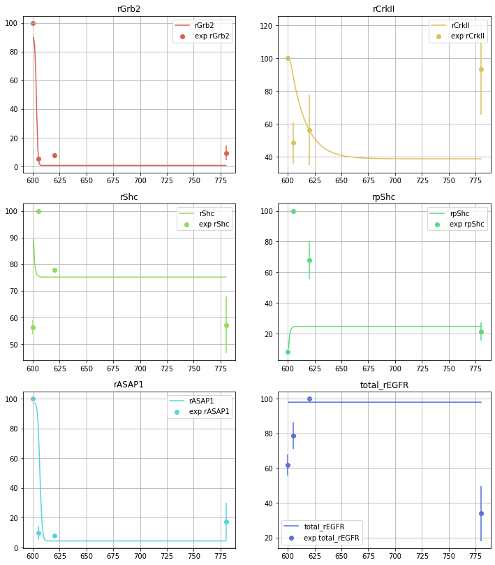

# Log Book

It is always a good idea to intermediary results as they form a linear line of reasoning in conjunction with publishable results, which can be followed more easily by the reader.

## New PEAK Project - a brief overview

This project 


### Sep 07 recorded training session 

The following network topology was used for the training session:


The filepath of the model is:
`
src\models\peak3\peak3_model.pkl
`

The following is a summary of the training session:

Initial hyperparameters: 

```python

stim_time = 600
stim_value = 8.33 # defunct in this version
global_sim_time = stim_time + 180
colours = ['#db5f57', '#dbc257', '#91db57', '#57db80',
           '#57d3db', '#5770db', '#a157db', '#db57b2']

rr.integrator.relative_tolerance = 1e-8
rr.integrator.absolute_tolerance = 1e-8
rr.integrator.nonnegative = True # This setting is likely defunct

bounds = create_bounds(init_paramset, 5) 
pop_size = 15
max_iter = 1000
```

| Metric | Value |
| Weighted MSE | 7332.27 |

The following is a plot of the training session:


Pre-training visualisation of fit: 


Post-training visualisation of fit:



a MSE error of > 7000 indicates that the model is not yet fit to the data. 


